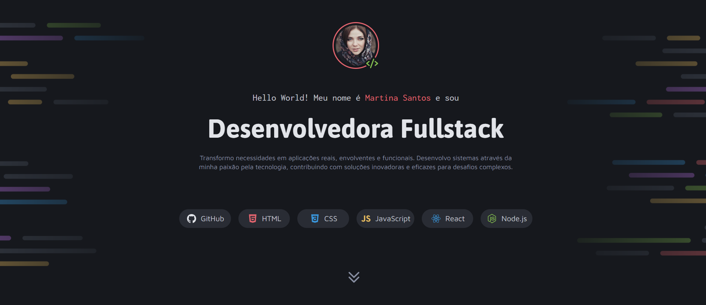
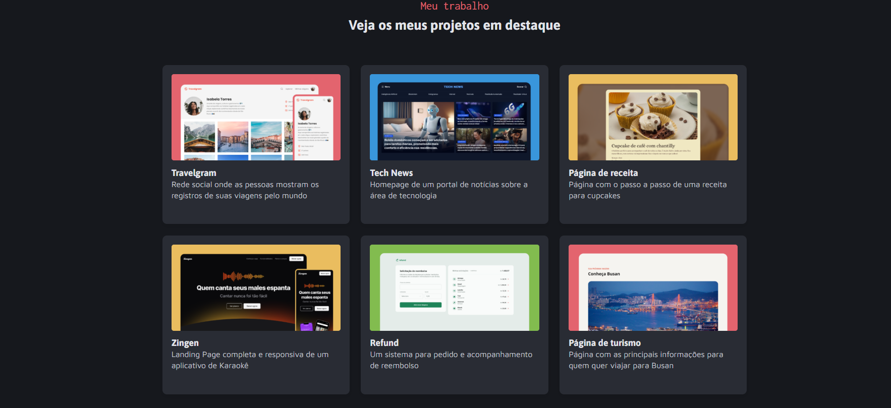
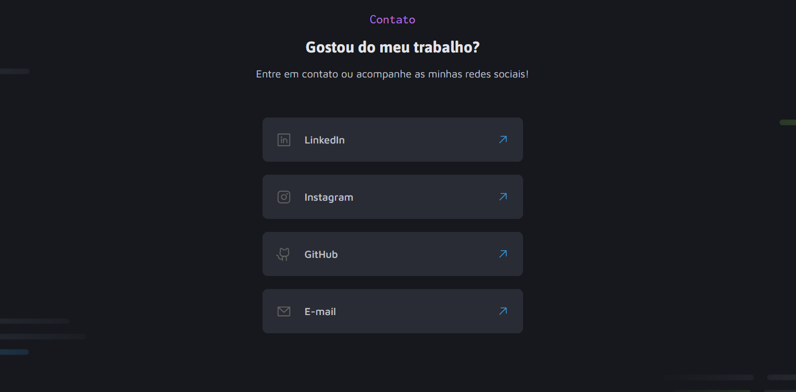

# 🖥 Projeto Portfólio Dev  

Projeto desenvolvido para apresentar meu portfólio como desenvolvedora, utilizando **HTML5** e **CSS3**.  
O objetivo foi criar uma página simples, organizada e com visual moderno para exibir meus projetos e formas de contato.  

---

## 📍 Acesse o Projeto  
👉 [Clique aqui para ver online](https://fernandacanejo.github.io/Projeto-Portfolio-dev/)  

---

## ✨ Funcionalidades  
- Página estática com layout limpo  
- Seção de apresentação pessoal  
- Listagem de projetos desenvolvidos  
- Serviços oferecidos e contatos  

---

## 🛠️ Tecnologias Utilizadas  
- **HTML5** para estruturação semântica  
- **CSS3** para estilização e layout responsivo
- **JavaScript** — Scroll suave entre seções  

---

## 💡 Aprendizados  
Durante o desenvolvimento deste projeto, pude reforçar:  
- Estruturação correta do conteúdo com HTML  
- Organização do CSS para facilitar manutenção  
- Importância do design simples e direto para portfólios
- Uso de **Flexbox** e **Grid** para criar layouts flexíveis e responsivos  
- Aplicação de JavaScript para melhorar a experiência do usuário 

---

## 📸 Prévia  

---

